# NYC Housing Equity & Policy Analytics

## Project Overview

This project investigates how neighborhood socioeconomic conditions shape housing complaint patterns and service outcomes in New York City. Using integrated administrative data from NYC 311, Housing Preservation and Development (HPD), the Department of Buildings (DOB), and the American Community Survey (ACS), the analysis evaluates whether neighborhood income is embedded within housing complaint systems themselves—not merely as an external explanatory variable.

Rather than testing a single causal hypothesis, the project builds and evaluates predictive models of neighborhood median income using engineered features derived exclusively from housing complaint intensity, composition, and resolution outcomes. If income can be predicted from these administrative records, it suggests that socioeconomic context is deeply encoded in how residents interact with housing service systems and how those systems respond.

All results are presented through reproducible, web-based analytical reports built using **R and Quarto**.

---

## Research Question

**To what extent do neighborhood income levels influence the spatial distribution, types, and resolution outcomes of housing complaints in New York City?**

---

## Key Figures (from the report)

> Replace these placeholder images with your real figures (same filenames) when you publish the repo.

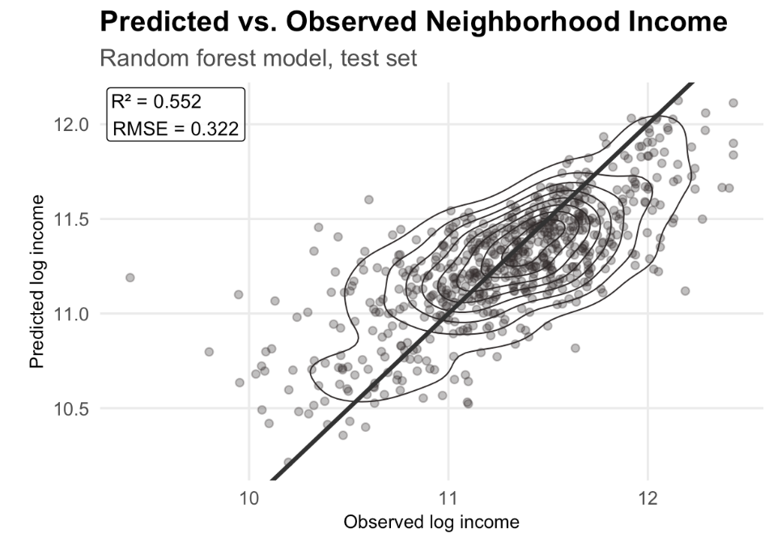

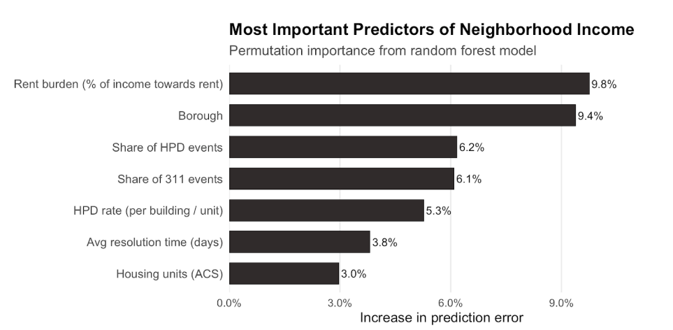

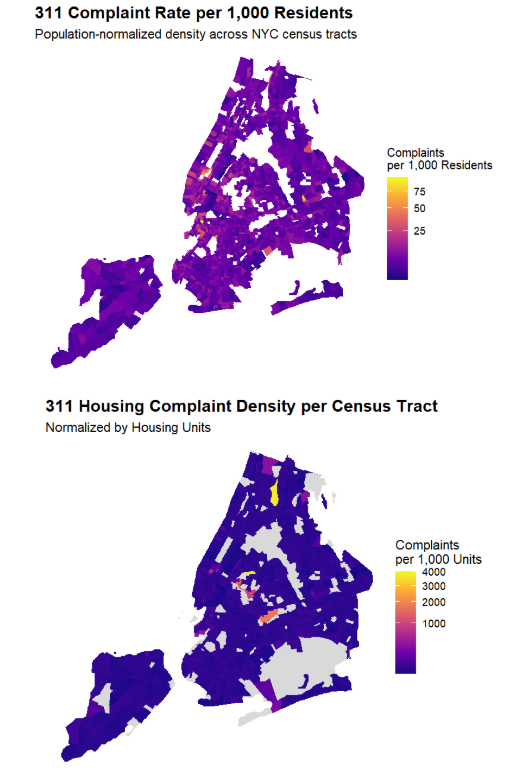

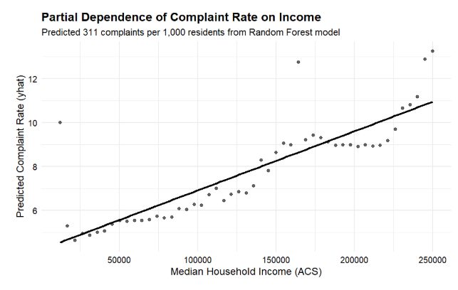

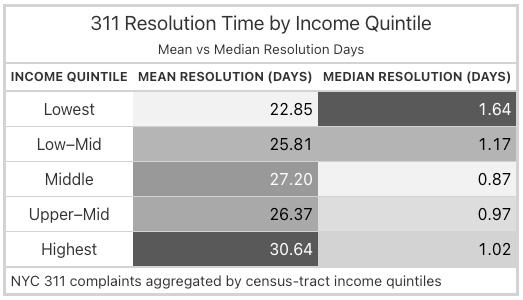

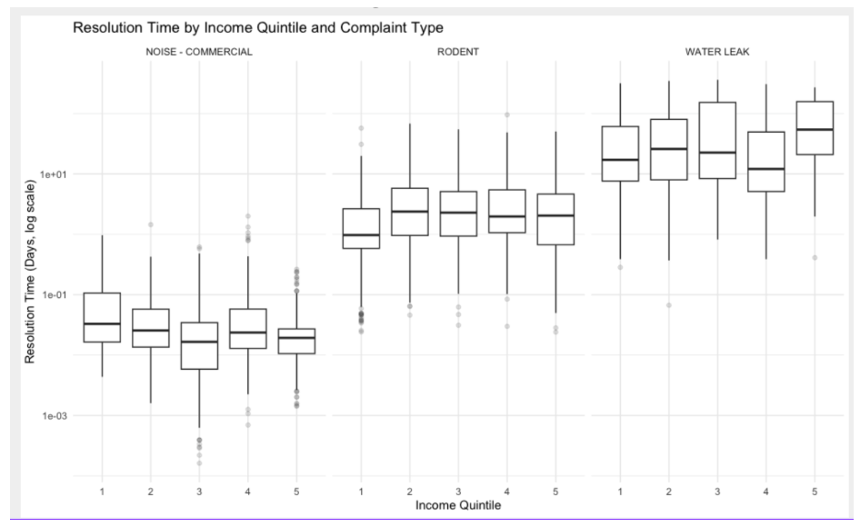

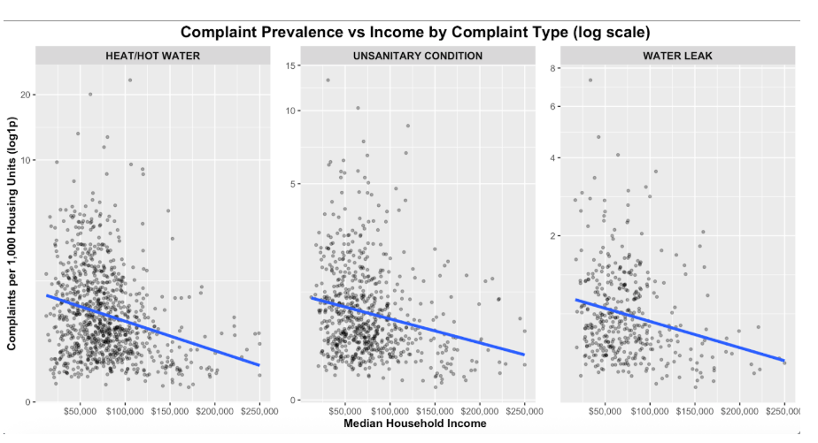

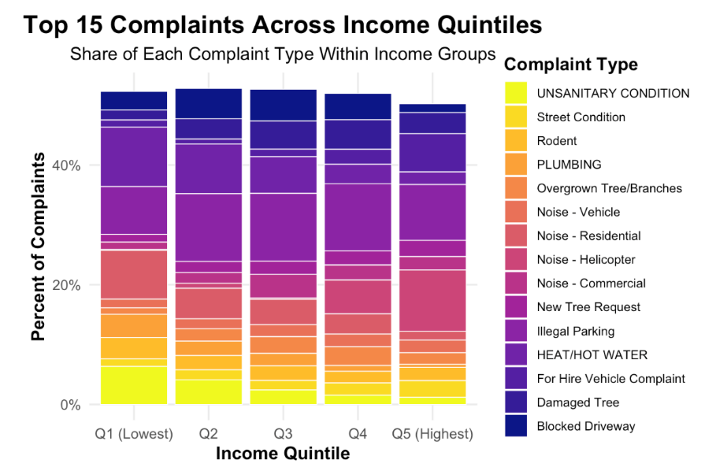

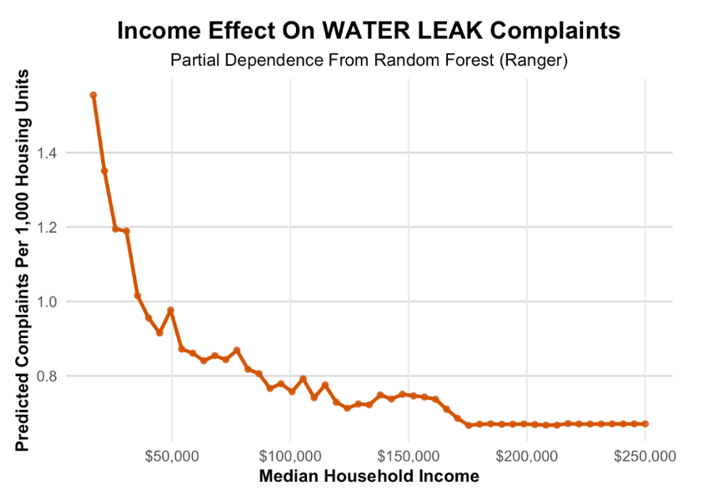

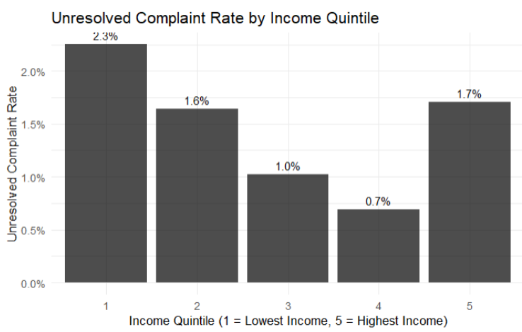

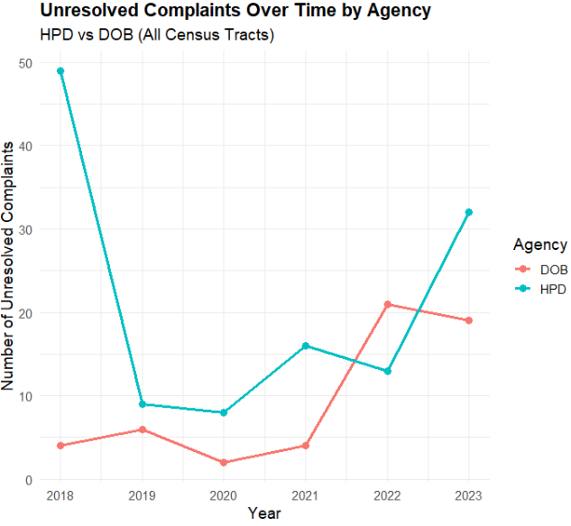

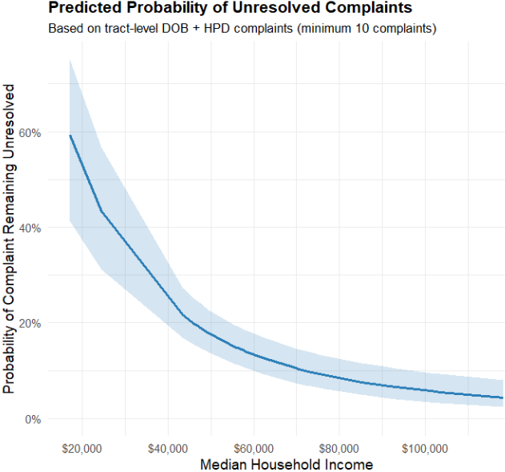

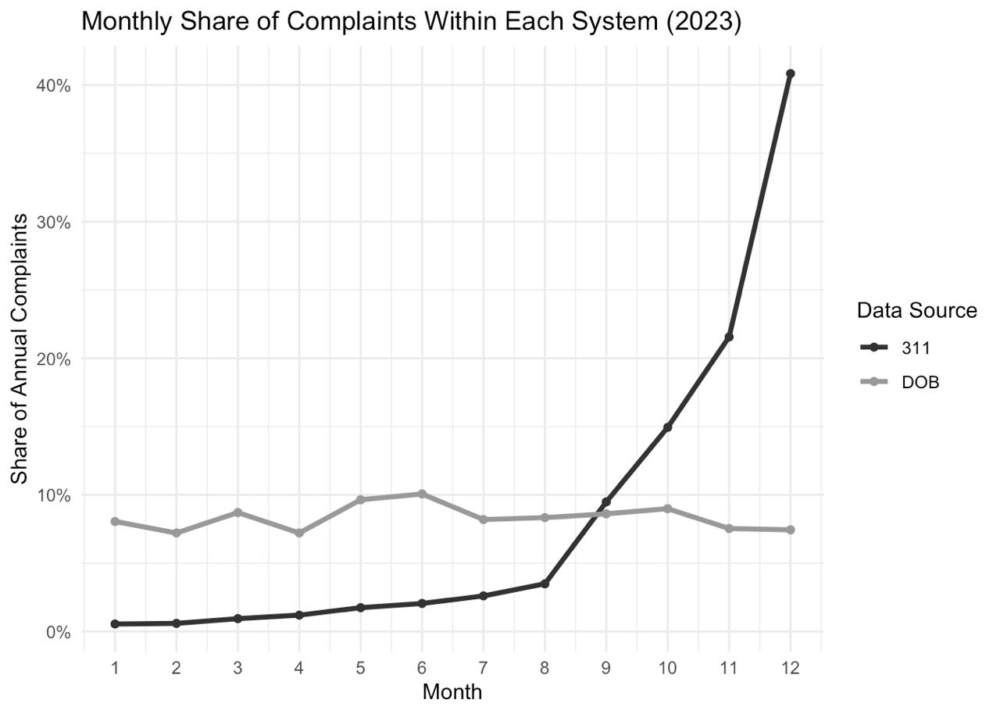

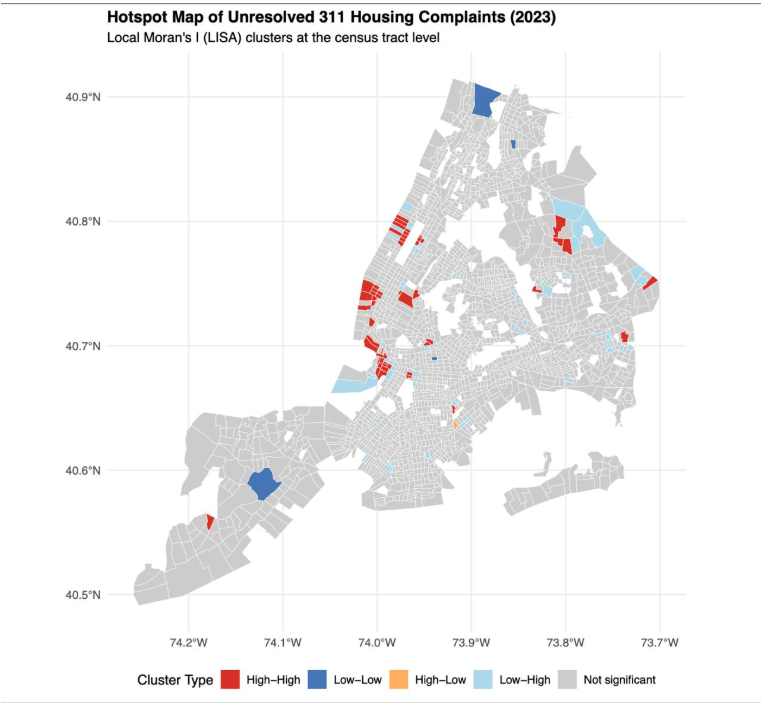

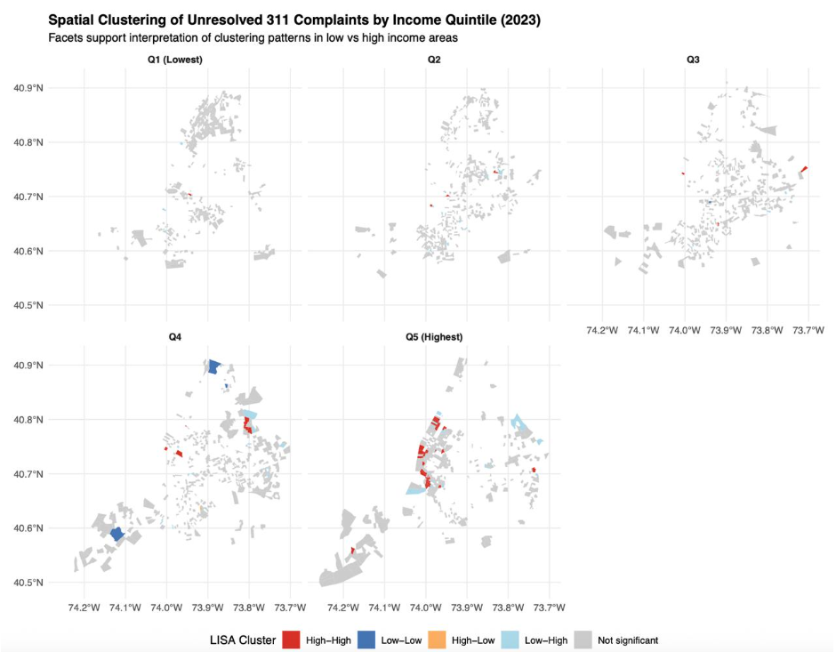

---

## Data Sources

This analysis integrates multiple public datasets, all aggregated to the **census tract level** for spatial consistency:

- **NYC 311 Service Requests (2023)** — NYC Open Data API  
- **Housing Preservation & Development (HPD)** — complaints/violations  
- **Department of Buildings (DOB)** — complaints/enforcement actions  
- **American Community Survey (ACS) 5-Year Estimates** — via `tidycensus`

---

## Feature Engineering (Tract Level)

Feature families include:

- **Structural Controls:** rent burden, housing units, population, borough indicators  
- **Complaint Intensity:** complaint rates per capita by source  
- **Complaint Composition:** shares by agency/type (e.g., heat-related complaints)  
- **Resolution Outcomes:** mean/median resolution time; unresolved complaint rates  

---

## Modeling Strategy

- Outcome: **log(median household income)** (ACS)  
- Split: **70/30 train-test**  
- Validation: **5-fold cross-validation** on training set  
- Metrics: **RMSE, MAE, out-of-sample R²**

### Models compared
- OLS
- Elastic Net (glmnet)
- Random Forest (ranger) — tuned (`mtry`, `splitrule`, `min.node.size`), 1,000 trees

---

## Results Snapshot

- Random Forest achieved **out-of-sample R² ≈ 0.54** (test set), indicating substantial socioeconomic signal encoded in complaint systems.
- Structural stress measures (e.g., rent burden) and complaint composition/resolution metrics are among the most predictive features.

---

## Limitations

- Reporting bias (complaints are not a neutral measure of need)
- Cross-sectional scope (single-year focus)
- Predictive, not causal inference
- Unobserved landlord/legal/ownership factors

---

## Future Work

- Multi-year panel extension
- Systematic error analysis (where income is over/under-predicted)
- Interaction effects (income × rent burden × housing stock)
- Add Housing Court filings for enforcement context

---

## References

- Wang, L., Qian, C., Kats, P., Kontokosta, C., & Sobolevsky, S. (2017). *Structure of 311 service requests as a signature of urban location.* PLOS ONE  
- Kontokosta, C. E., & Hong, B. (2021). *Bias in smart city governance: How socio-spatial disparities in 311 complaint behavior impact fairness.* Sustainable Cities and Society
